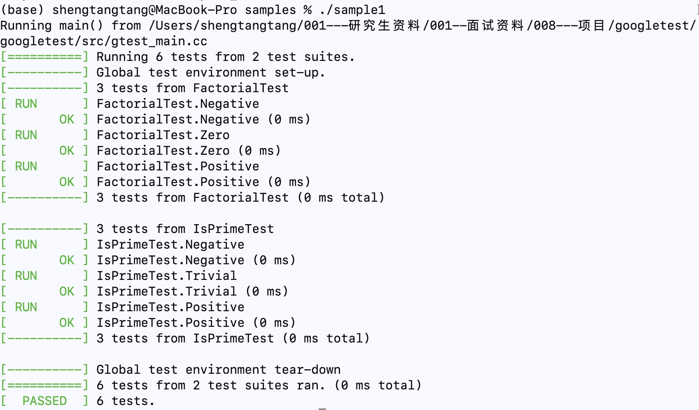

# GoogleTest 的安装与运行
```C++
git clone https://github.com/google/googletest.git
cd googletest
mkdir build && cd build
cmake ..
sudo make install
```

代码就编译完成

然后将build中的lib库拷贝到跟googletest文件夹所在的同一个目录下，也是我们写代码的主要目录(001---C++)
```
(base) shengtangtang@MacBook-Pro build % cp -R lib ../../
```
再找到include头文件，拷贝里面的文件到跟lib同样的目录下
```
(base) shengtangtang@MacBook-Pro googletest % cd googletest
(base) shengtangtang@MacBook-Pro googletest % cp -R include/ ../../ 
```
然后在当前目录下新建include文件夹存放头文件
```
(base) shengtangtang@MacBook-Pro 001---C++ % mkdir include
(base) shengtangtang@MacBook-Pro 001---C++ % mv gtest include
```
```
(base) shengtangtang@MacBook-Pro 001---C++ % cd include 
(base) shengtangtang@MacBook-Pro include % ls
gtest
```

至此，使用googletest的前期准备就做好了

编写测试程序 demo.cpp
```
(base) shengtangtang@MacBook-Pro 001---C++ % vim demo.cpp 
```
```C++
#include <stdio.h>
#include <gtest/gtest.h>
using namespace std;
int add(int a, int b) {
    return a + b;
}

TEST(test, add1) {
    EXPECT_EQ(add(3, 4), 7);  // ==
    EXPECT_NE(add(3, 4), 6);  // !=
    EXPECT_LT(add(3, 4), 8);  // <
    EXPECT_LE(add(3, 4), 7);  // <=
    EXPECT_GT(add(3, 4), 6);  // >
    EXPECT_GE(add(3, 4), 7);  // >=
}

TEST(test, add2) {
    EXPECT_EQ(add(3, 4), 7);  // ==
    EXPECT_NE(add(3, 4), 6);  // !=
    EXPECT_LT(add(3, 4), 6);  // <
    EXPECT_LE(add(3, 4), 7);  // <=
    EXPECT_GT(add(3, 4), 6);  // >
    EXPECT_GE(add(3, 4), 7);  // >=
}

int main() {
    return RUN_ALL_TESTS();
}
```

为了方便编译，写一个 makefile 文件
```
(base) shengtangtang@MacBook-Pro 001---C++ % vim makefile
```


然后 make 一下, 生成 a.out文件
```
(base) shengtangtang@MacBook-Pro 001---C++ % make        
g++ --std=c++11 -I./include -L./lib demo.cpp -lgtest
```
运行 a.out


# 完成一个自己的 goole测试框架

实现三个主要功能：
- EXPECT系列
- TEST宏
- RUN_ALL_TESTS()
- 输出带颜色的信息

## 基于函数实现

使用宏定义对这几个主要功能进行封装，具体通过函数实现

在当前目录下创建我们的工程mygooletest，新建 include文件夹，新建 ktest.h 头文件

```C+
#ifndef _KTEST_H
#define _KTEST_H

#define LOG(frm, args...) { \
  printf("[%s : %s : %d]", __FILE__, __func__ ,__LINE__); \
  printf(frm, ##args); \   
  printf("\n"); \
}

// 颜色封装
#define COLOR(msg, code) "\033[0;" #code "m" msg "\033[0m"

#define RED(msg) COLOR(msg, 31)
#define GREEN(msg) COLOR(msg, 32)
#define YELLOW(msg) COLOR(msg, 33)
#define BLUE(msg) COLOR(msg, 34)

// EXPECT系列封装
#define EXPECT(a, comp, b) { \
    __typeof(a) __a = (a), __b = (b); \
    if (!((__a) comp (__b))) { \
        func_flag = 0; \
        printf(YELLOW("  %s : %d : Failure\n"), __FILE__, __LINE__); \
        printf(YELLOW("    Expected: (%s) %s (%s), actual: %d vs %d\n"),  \
               #a, #comp, #b, __a, __b); \
    } \
}

#define EXPECT_EQ(a, b) EXPECT(a, ==, b);
#define EXPECT_NE(a, b) EXPECT(a, !=, b);
#define EXPECT_LT(a, b) EXPECT(a, <, b);
#define EXPECT_LE(a, b) EXPECT(a, <=, b);
#define EXPECT_GT(a, b) EXPECT(a, >, b);
#define EXPECT_GE(a, b) EXPECT(a, >=, b);

//扩展出来的函数头部信息
// //扩展出来相关的注册函数
#define FUNC_NAME(a, b) shengtang_##a##_##b
#define TEST(a, b) \
void FUNC_NAME(a, b)(); \ 
__attribute__((constructor)) \
void reg_##shengtang_##a##_##b() { \        
    add_test_function(FUNC_NAME(a, b), #a "." #b); \
} \
void FUNC_NAME(a, b)()

// 存储区, 每个位置存储一个测试用例的函数地址
struct FuncData {
    void (*func)();  //测试用例的函数地址
    const char *func_name;   // 测试用例的函数名称
} func_arr[100];
int fun_arr_cnt = 0;  //计数量，计数当前存储区中存储了多少个测试用例
int func_flag;

void add_test_function(void (*func)(), const char *str) {
    func_arr[fun_arr_cnt].func = func;
    func_arr[fun_arr_cnt].func_name = str;
    fun_arr_cnt += 1;
    return ;
}

const char *RUN    = GREEN("[  RUN       ]");
const char *OK     = GREEN("[   OK       ]");
const char *FAILED = RED("[  FAILED    ]");


int RUN_ALL_TESTS() {
    // 遍历运行每个测试用例
    for (int i = 0; i < fun_arr_cnt; ++i) {
        printf("%s  %s\n", RUN, func_arr[i].func_name);
        func_flag = 1;
        long long b = clock();
        func_arr[i].func();
        long long e = clock();
        if (func_flag)
            printf("%s", OK);
        else
            printf("%s ", FAILED);
        printf("%s   "YELLOW("(%lld ms)") "\n", func_arr[i].func_name, 
              (e - b) * 1000 / CLOCKS_PER_SEC);

    }

    return 0;
}

#endif
```
然后新建 makefile 文件，里面写入编译规则


运行结果：


## 基于类实现
在当前目录下创建我们的工程mygoogletest2，新建 include文件夹，新建 ctest.h 头文件

1. TestCase类：TestCase类包含一个测试案例的基本信息，包括：测试案例名称，测试案例执行结果，同时提供了测试案例执行的方法。我们编写的测试案例都继承自TestCase类。
2. UnitTest类：我们的UnitTest类和gtest的一样，是一个单件。我们的UnitTest类的逻辑非常简单：
   - 整个进程空间保存一个UnitTest 的单例。
   - 通过RegisterTestCase()将测试案例添加到测试案例集合testcases_中。
   - 执行测试案例时，调用UnitTest::Run()，遍历测试案例集合testcases_，调用案例的Run()方法
### 1. TestCase类定义
```C++
class TestCase {
public:
    TestCase(const char *case_name) : testcase_name(case_name) {}

    virtual void Run() = 0;  // 执行测试案例的方法

    int nTestResult;  // 测试案例的执行结果 
    const char *testcase_name;  // 测试案例名称
};
```
### 2. UnitTest类定义
```C++
class UnitTest {
public:
    // 获取单例
    static UnitTest* GetInstance(); 

    // 注册测试案例
    TestCase* RegisterTestCase(TestCase* testcase);

    // 执行单元测试
    int Run();

    TestCase* CurrentTestCase; // 记录当前执行的测试案例
    int nTestResult; // 总的执行结果
    int nPassed; // 通过案例数
    int nFailed; // 失败案例数
private:
    std::vector<TestCase*> testcases_; // 案例集合
};
```
### 3. UnitTest类实现
```C++
int fail = 0;   //定义为全局变量，记录测试案例的错误个数

UnitTest* UnitTest::GetInstance() {
    static UnitTest instance;
    return &instance; 
}

TestCase* UnitTest::RegisterTestCase(TestCase* testcase) {
    testcases_.push_back(testcase);
    return testcase;
}

int UnitTest::Run() {
    UnitTest::nTestResult = 1;
    for (std::vector<TestCase*>::iterator it = testcases_.begin();
            it != testcases_.end(); ++it) 
    {
        TestCase *tmp = *it;
        CurrentTestCase = tmp;
        printf(GREEN("======================================\n"));
        printf(GREEN("Run TestCase :  %s\n"), tmp->testcase_name);
        tmp->Run();
        printf(GREEN("End TestCase :  %s\n"), tmp->testcase_name);

        if (tmp->nTestResult)
            nPassed++;

        else {
            nFailed++;
            nTestResult = 0; 
        }
    }
    printf(GREEN("======================================\n"));
    printf(GREEN("Total TestCase :  %d\n"), nPassed + nFailed);
    printf(GREEN("Passed :  %d\n"), nPassed + nFailed - fail);
    printf(RED("Failed :  %d\n"), fail);
    return nTestResult;
}
```
### 4. NTEST宏
接下来定一个宏NTEST，方便我们写我们的测试案例的类。
```C++
#define TESTCASE_NAME(testcase_name) \
    testcase_name##_TEST

#define NANCY_TEST_(testcase_name) \
class TESTCASE_NAME(testcase_name) : public TestCase { \
public: \
    TESTCASE_NAME(testcase_name)(const char* case_name) : TestCase(case_name) {}; \
    virtual void Run(); \  
private: \
    static TestCase* const testcase_; \
}; \
\
TestCase* const TESTCASE_NAME(testcase_name)::testcase_ =  \
    UnitTest::GetInstance()->RegisterTestCase(new TESTCASE_NAME(testcase_name)(#testcase_name)); \
void TESTCASE_NAME(testcase_name)::Run()


// TEST宏
#define NTEST(testcase_name) \
    NANCY_TEST_(testcase_name)
```
### 5. RUN_ALL_TEST宏
然后是执行所有测试案例的一个宏：
```C++
#define RUN_ALL_TESTS() \
    UnitTest::GetInstance()->Run();
```
### 6. 七、断言的宏EXPECT系列实现
```C++
#define EXPECT(a, comp, b) { \
    __typeof(a) __a = (a), __b = (b); \
    if (!((__a) comp (__b))) { \
        UnitTest::GetInstance()->CurrentTestCase->nTestResult = 0; \
        fail++; \
        printf(RED("    Failed\n")); \
        printf(RED("    Expected: (%s) %s (%s)\n"), #a, #comp, #b); \
        printf(RED("    Actual : %d vs %d\n"), __a, __b); \
    } \
}

#define EXPECT_EQ(a, b) EXPECT(a, ==, b);
#define EXPECT_NE(a, b) EXPECT(a, !=, b);
#define EXPECT_LT(a, b) EXPECT(a, <, b);
#define EXPECT_LE(a, b) EXPECT(a, <=, b);
#define EXPECT_GT(a, b) EXPECT(a, >, b);
#define EXPECT_GE(a, b) EXPECT(a, >=, b);
```
### 7. 测试的Demo
```C++
#include <shengtang/ctest.h>

int add(int a, int b) {
    return a + b;
}

NTEST(AddTest1) {
    
    EXPECT_EQ(add(3, 4), 7);  // ==
    EXPECT_NE(add(3, 4), 6);  // !=
    EXPECT_LT(add(3, 4), 8);  // <
    EXPECT_LE(add(3, 4), 7);  // <=
    EXPECT_GT(add(3, 4), 6);  // >
    EXPECT_GE(add(3, 4), 7);  // >=
}

NTEST(Addtest2) {
    
    EXPECT_EQ(add(3, 4), 7);  // ==
    EXPECT_NE(add(3, 4), 6);  // !=
    EXPECT_LT(add(3, 4), 6);  // <
    EXPECT_LE(add(3, 4), 7);  // <=
    EXPECT_GT(add(3, 4), 6);  // >
    EXPECT_GE(add(3, 4), 7);  // >=
}

int main() {
    return RUN_ALL_TESTS();
}
```

编译运行：


# 用设计的测试框架测试一个快速排序算法，
用自己实现的测试框架对快速排序算法进行测试
```C++
#include <iostream>
#include <vector>
#include <time.h>
#include <shengtang/ktest.h>
using namespace std;

void quick_sort_v1(int *arr, int l, int r) {
    if (l >= r)
        return;
    int x = l, y = r, z = arr[l];
    while (x < y) {
        while (x < y && arr[y] >= z)
            --y;
        if (x < y)
            arr[x++] = arr[y];
        while (x < y && arr[x] <= z)
            ++x;
        if (x < y)
            arr[y--] = arr[x];
    }
    arr[x] = z;

    quick_sort_v1(arr, l, x - 1);
    quick_sort_v1(arr, x + 1, r);
    return ;
}

#define MAX_N 10000000
int *arr;
int *getRandData(int n) {
    int *arr = (int *)malloc(sizeof(int) * n);
    for (int i = 0; i < n; i++) {
        arr[i] = rand() % n;
    }
    return arr;
}

int check(int *arr, int n) {
    for (int i = 1; i < n; ++i) {
        if (arr[i] < arr[i - 1])
            return 0;
    }
    return 1;
}

int *copyArray(int *arr, int n) {
    int *tmp = (int *)malloc(sizeof(int) * n);
    memcpy(tmp,arr, sizeof(int) * n);
    return tmp;
}

TEST(test, quick_sort_v1) {
    int *tmp =  copyArray(arr, MAX_N);
    quick_sort_v1(tmp, 0, MAX_N - 1);
    EXPECT_EQ(check(tmp, MAX_N), 1);
}

int main() {
    srand(time(0));
    arr = getRandData(MAX_N);

    return RUN_ALL_TESTS();
}
```
在 makefile 文件中 加入对此文件的编译


然后运行，可以看出结果正确


C++ STL的Sort排序，面对大数据时，使用快速排序，对大数据进行分区。分为多个组后，组间有序，组内无序，然后在每组内对小规模数据进行插入排序的时间复杂度可达到O(N)，
在 Sort中设置了一个递归深度控制，当当前快速排序的层数过深后，直接改成堆排序，


C++ STL sort 优化的地方：
- 开始排序，传入待排序区间范围
- 对区间做 partition 操作， (无监督，三点取中）
- 对元素数量 <= threshold 的区间停止使用快速排序， 改成插入排序
- 递归深度控制，超过一定深度，采用 heap-sort 堆排序
- 最后收尾排序对每个区间采用 insert-sort 插入排序，

```C++
#include <iostream>
#include <vector>
#include <time.h>
#include <shengtang/ktest.h>
using namespace std;

void quick_sort_v1(int *arr, int l, int r) {
    if (l >= r)
        return;
    int x = l, y = r, z = arr[l];
    while (x < y) {
        while (x < y && arr[y] >= z)
            --y;
        if (x < y)
            arr[x++] = arr[y];
        while (x < y && arr[x] <= z)
            ++x;
        if (x < y)
            arr[y--] = arr[x];
    }
    arr[x] = z;

    quick_sort_v1(arr, l, x - 1);
    quick_sort_v1(arr, x + 1, r);
    return ;
}

#define swap(a, b) { \
    __typeof(a) __a = a; \
    a = b, b = __a; \
}

// 三点取中法
int median(int a, int b, int c) {
    if (a > b)
        swap(a, b)
    if (a > c)
        swap(a, c);
    if (b > c)
        swap(b, c);
    return b;
}

// 单边递归法，三点取中法, 无监督partition
void quick_sort_v2(int *arr, int l, int r) {
    while (l < r) {
        int x = l, y = r;
        int z = median(arr[l], arr[(l + r) >> 1], arr[r]);  //三点取中
        do {
            while (arr[x] < z)
                x++;
            while (arr[y] > z)
                y--;
            if (x <= y) {
                swap(arr[x], arr[y]);
                x++;
                y--;
            }
                
        }while (x <= y);
        quick_sort_v2(arr, x, r); //对右区间进行递归排序，
        r = y;    // 左区间在本层进行排序
    }  
    
    return ;
}

#define MAX_N 10000000
int *arr;
int *getRandData(int n) {
    int *arr = (int *)malloc(sizeof(int) * n);
    for (int i = 0; i < n; i++) {
        arr[i] = rand() % n;
    }
    return arr;
}

int check(int *arr, int n) {
    for (int i = 1; i < n; ++i) {
        if (arr[i] < arr[i - 1])
            return 0;
    }
    return 1;
}

int *copyArray(int *arr, int n) {
    int *tmp = (int *)malloc(sizeof(int) * n);
    memcpy(tmp,arr, sizeof(int) * n);
    return tmp;
}

TEST(test, quick_sort_v1) {
    int *tmp =  copyArray(arr, MAX_N);
    quick_sort_v1(tmp, 0, MAX_N - 1);
    EXPECT_EQ(check(tmp, MAX_N), 1);
}

TEST(test, quick_sort_v2) {
    int *tmp =  copyArray(arr, MAX_N);
    quick_sort_v2(tmp, 0, MAX_N - 1);
    EXPECT_EQ(check(tmp, MAX_N), 1);
}

int main() {
    srand(time(0));
    arr = getRandData(MAX_N);

    return RUN_ALL_TESTS();
}
```

优化过后的快速排序性能比较


最终版本的快速排序
```C++
#include <iostream>
#include <vector>
#include <time.h>
#include <shengtang/ktest.h>
using namespace std;

// 版本1， 简单的快速排序
void quick_sort_v1(int *arr, int l, int r) {
    if (l >= r)
        return;
    int x = l, y = r, z = arr[l];
    while (x < y) {
        while (x < y && arr[y] >= z)
            --y;
        if (x < y)
            arr[x++] = arr[y];
        while (x < y && arr[x] <= z)
            ++x;
        if (x < y)
            arr[y--] = arr[x];
    }
    arr[x] = z;

    quick_sort_v1(arr, l, x - 1);
    quick_sort_v1(arr, x + 1, r);
    return ;
}

#define swap(a, b) { \
    __typeof(a) __a = a; \
    a = b, b = __a; \
}

// 三点取中法
int median(int a, int b, int c) {
    if (a > b)
        swap(a, b)
    if (a > c)
        swap(a, c);
    if (b > c)
        swap(b, c);
    return b;
}

// 版本2，单边递归法，三点取中法, 无监督partition
void quick_sort_v2(int *arr, int l, int r) {
    while (l < r) {
        int x = l, y = r;
        int z = median(arr[l], arr[(l + r) >> 1], arr[r]);  //三点取中
        do {
            while (arr[x] < z)
                x++;
            while (arr[y] > z)
                y--;
            if (x <= y) {
                swap(arr[x], arr[y]);
                x++;
                y--;
            }
                
        }while (x <= y);
        quick_sort_v2(arr, x, r); //对右区间进行递归排序，
        r = y;    // 左区间在本层进行排序
    }  
    return ;
}

const int threshold = 16;

void __quick_sort_v3(int *arr, int l, int r) {
    while (r - l > threshold) {
        int x = l, y = r;
        int z = median(arr[l], arr[(l + r) >> 1], arr[r]);  //三点取中
        do {
            while (arr[x] < z)
                x++;
            while (arr[y] > z)
                y--;
            if (x <= y) {
                swap(arr[x], arr[y]);
                x++;
                y--;
            }
                
        }while (x <= y);
        __quick_sort_v3(arr, x, r); //对右区间进行递归排序，
        r = y;    // 左区间在本层进行排序
    }  
    return ;
}

// 插入排序，优化版
void insert_sort(int *arr, int l, int r) {
    int ind = l;
    for (int i = l + 1; i <= r; ++i) {
        if (arr[ind] > arr[i])
            ind = i;
    }
    swap(arr[ind], arr[l]);
    for (int i = l + 2; i <= r; ++i) {
        int j = i;
        while (arr[j] < arr[j - 1]) {
            swap(arr[j], arr[j - 1]);
            --j;
        }
    }
    return ;
}

//版本3， 设定阈值 + 插入排序
void quick_sort_v3(int *arr, int l, int r) {
    __quick_sort_v3(arr, l, r);
    insert_sort(arr, l, r);
    return ;
}


#define MAX_N 10000000
int *arr;
int *getRandData(int n) {
    int *arr = (int *)malloc(sizeof(int) * n);
    for (int i = 0; i < n; i++) {
        arr[i] = rand() % n;
    }
    return arr;
}

int check(int *arr, int n) {
    for (int i = 1; i < n; ++i) {
        if (arr[i] < arr[i - 1])
            return 0;
    }
    return 1;
}

int *copyArray(int *arr, int n) {
    int *tmp = (int *)malloc(sizeof(int) * n);
    memcpy(tmp,arr, sizeof(int) * n);
    return tmp;
}

TEST(test, quick_sort_v1) {
    int *tmp =  copyArray(arr, MAX_N);
    quick_sort_v1(tmp, 0, MAX_N - 1);
    EXPECT_EQ(check(tmp, MAX_N), 1);
}

TEST(test, quick_sort_v2) {
    int *tmp =  copyArray(arr, MAX_N);
    quick_sort_v2(tmp, 0, MAX_N - 1);
    EXPECT_EQ(check(tmp, MAX_N), 1);
}

TEST(test, quick_sort_v3) {
    int *tmp =  copyArray(arr, MAX_N);
    quick_sort_v3(tmp, 0, MAX_N - 1);
    EXPECT_EQ(check(tmp, MAX_N), 1);
}

int main() {
    srand(time(0));
    arr = getRandData(MAX_N);

    return RUN_ALL_TESTS();
}
```


# 框架分析
**什么是好的测试框架**：
- 测试应该好似独立的和可重复的，像调试其他测试的结果一样，调试一个结果为成功或失败的测试是一件痛苦的事gtest 通过使每个测试运行在不同的对象中从而使测试隔离。当一个测试失败时，gtest允许将它运行在隔离的环境下从而达到快速调试的目的
- 测试应该要有良好的组织以反映被测试代码的结构。gtest将相关的测试划分到一个测试组内，并且测试组内的测试能共享数据和子例程。这种普通的模式易于识别，也使测试易于维护。当需要切换项目并且在一个新的代码库中开展工作的时候，这种一致性 特别有用。
- 测试应该是可移植的和可复用的。开源社区有很多与平台无关的代码，那么它的测试代码也应该要与平台无关的。gtest能在不同的操作系统下工作，并且支持不同的编译器，包括支持带或者不带异常处理的编译器，所以gtest测试框架下的测试能在各种各样的配置环境下工作。
- 当测试失败时应该尽可能地提供关于问题的信息。gtest不会因为碰到第- -个测试失败就停止，而是仅仅停止当前的测试并且接着下一个测试。你能把测试设置成报告非致命错误后继续执行。因此你能在单个运行-编辑-编译的周期内发现并修复多个bug
- 测试框架让测试人员不再需要编写那些琐碎的代码，而是让他们专注于测试内容。gtest能 自动跟踪所有已定义的测试，不需要用户为了执行它们而去重新列举它们
- 测试要求快速。在gtest下， 你能在测试之间重用共享的资源，并且仅仅执行setup/teardown 一次，使测试不依赖于其它

例：运行sample1_unittest.cc
定位到这些文件所在的目录下：
```
(base) shengtangtang@MacBook-Pro samples % g++ sample1.cc sample1_unittest.cc -o sample1 -lpthread -lgtest -std=c++11 -lgtest_main 
```
因为没有 main函数，所以后面加 -lgtest_main，然后运行。
也可以在 sample1_unittest.cc 后面加上main函数，运行
```C++
int main() {
    return RUN_ALL_TESTS();
}
```



从 2个测试套件中运行6个测试样例，
**Global test environment set-up**： 初始化环境
**Global test environment tear-down**： 销毁环境

GTest框架将我们相同测试用例名的场景合并在一起，不同测试特例名的场景分开展现。而且我们还发现GTest有自动统计结果、自动格式化输出结果、自动调度执行等特性

虽然上例中，所有的执行都是正确的，但是如果以上测试中发生一个错误，也不能影响其他测试——不同测试用例不相互影响、相同测试用例不同测试特例不相互影响。我们称之为**独立性**。除了独立性，也不失**灵活性**——一个测试测试特例中可以通过不同宏（ASSERT_*类宏会影响之后执行，EXPECT_*类宏不会）控制是否影响之后的执行

如果我们编写的测试用例组（如上例是两组）中一组发生了错误，我们希望没出错的那组不用执行了，出错的那组再执行一遍。一般情况下，我们可能需要去删除执行正确的那段测试代码，但是这种方式非常不优美——需要编译或者忘记恢复代码。GTest框架可以让我们通过在程序参数控制执行哪个测试用例，比如我们希望只执行Factorial测试，就可以这样调用程序
```C++
./sample1_unittest --gtest_filter=Factorial*
```
我们可以将以上特性称之为 **选择性测试**


## 1. 参数化与类型化
若要测试很多参数的话，则要写多次 EXPECT_TRUE，因此使用参数化：
1. **告诉gtest你的参数类型是什么**
   你必须添加一个类，继承`testing::TestWithParam<T>`，其中T就是你需要参数化的参数类型
2. **告诉gtest你拿到参数的值后，具体做些什么样的测试**
   这里，我们要使用一个新的宏：TEST_P，关于这个"P"的含义，Google给出的答案非常幽默，就是说你可以理解为”parameterized" 或者 "pattern"。在`TEST_P`宏里，使用`GetParam()`获取当前的参数的具体值
3. **告诉gtest你想要测试的参数范围是什么**
   使用`INSTANTIATE_TEST_CASE_P`这宏来告诉gtest你要测试的参数范围
   
   第一个参数是测试案例的前缀，可以任意取
   
   第二个参数是测试案例的名称，需要和之前定义的参数化的类的名称相同，如：IsPrimeParamTest 
   
   第三个参数是可以理解为参数生成器，上面的例子使用test::Values表示使用括号内的参数。Google提供了一系列的参数生成的函数：
   - range(begin, end[, step])：范围在begin~end之间，步长为step，不包括end
   - values(v1, v2, ..., vN)： v1,v2到vN的值
   - valuesIn(container) and valuesIn(begin, end)： 从一个C类型的数组或是STL容器，或是迭代器中取值
   - bool()： 取false 和 true 两个值
   - combine(g1, g2, ..., gN)： 这个比较强悍，它将g1,g2,...gN进行排列组合，g1,g2,...gN本身是一个参数生成器，每次分别从g1,g2,..gN中各取出一个值，组合成一个元组(Tuple)作为一个参数。
     > 说明：这个功能只在提供了<tr1/tuple>头的系统中有效。gtest会自动去判断是否支持tr/tuple，如果你的系统确实支持，而gtest判断错误的话，你可以重新定义宏GTEST_HAS_TR1_TUPLE=1


```C++
// 参数化
/* 1. 添加类，继承自 public::testing::TestWithParam<T>*/
class IsPrimeParamTest : public::testing::TestWithParam<int>
{

};
/* 2. 获取参数，并测试 */
TEST_P(IsPrimeParamTest, HandleTrueReturn)
{
	int n = GetParam();
	EXPECT_TRUE(IsPrime(n));
}
/* 3. 告诉 gtest 你的测试参数 */
INSTANTIATE_TEST_SUITE_P(TrueReturn, IsPrimeParamTest, testing::Values(3, 5, 11, 23, 17));

// 通过枚举将这5个数同时作为参数传入 IsPrime(n), googletest 就可以进行相同类型多用例测试
```

编译运行后：


## 2. gtest 事件机制：
在GTest中有了测试事件的这个机制，就能能够在测试之前或之后能够做一些准备/清理的操作。根据事件执行的位置不同，我们可将测试事件分为三种：
### 1. testcase 事件
这个级别的事件会在TestCase之前与之后执行, 每个测试用例执行前后，里面的对象在每个测试用例的前面和后面(调用之初和调用结束时)调用相应的函数如 SetUp() 和 TearDown(),多次对类初始使用测试
  类中的变量在一个测试用例中是存在的，
  
TestCase测试事件，需要实现两个函数SetUp()和TearDown()。

这两个函数是不是有点像类的构造函数和析构函数，但是切记他们并不是构造函数和析构函数。这两个函数是testing::Test的成员函数，我们在编写测试类时需要继承testing::Test。
```C++
#include <iostream>
#include <gtest/gtest.h>

class calcFunction
{
public:
    int add(int a, int b)
    {
        return a + b;
    }

    int sub(int a, int b)
    {
        return a - b;
    }
};

class calcFunctionTest : public testing::Test
{
protected:
    virtual void SetUp()
    {
        std::cout << "--> " << __func__ << " <--" <<std::endl;
    }
    virtual void TearDown()
    {
        std::cout << "--> " << __func__ << " <--" <<std::endl;
    }

    calcFunction calc;

};

TEST_F(calcFunctionTest, test_add)
{
    std::cout << "--> test_add start <--" << std::endl;
    EXPECT_EQ(calc.add(1,2), 3);
    std::cout << "--> test_add end <--" << std::endl;
}

TEST_F(calcFunctionTest, test_sub)
{
    std::cout << "--> test_sub start <--" << std::endl;
    EXPECT_EQ(calc.sub(1,2), -1);
    std::cout << "--> test_sub end <--" << std::endl;
}

int main(int argc, char **argv)
{  
    testing::InitGoogleTest(&argc, argv);  
    return RUN_ALL_TESTS(); 
} 
```


### 2. testsuite 事件
  这个级别的事件会在TestSuite中第一个TestCase之前与最后一个TestCase之后执行, 在某一批案例中，第一个执行前到最后一个执行后，类只会调用一次，
  一般用于类行为测试，或有其他联系到多个方法测试 
  类中的值在类的生命周期中一直存在
  
TestSuite测试事件，同样的也需要实现的两个函数SetUpTestCase()和TearDownTestCase()，而这两个函数是静态函数。这两个静态函数同样也是testing::Test类的成员，我们直接改写下测试类calcFunctionTest，添加两个静态函数SetUpTestCase()和TearDownTestCase()到测试类中即可
```C++
class calcFunctionTest : public testing::Test
{
protected:
    static void SetUpTestCase()
    {
        std::cout<< "--> " <<  __func__ << " <--" << std::endl;
    }

    static void TearDownTestCase()
    {
        std::cout<< "--> " << __func__ << " <--" << std::endl;
    }

    virtual void SetUp()
    {
        std::cout << "--> " << __func__ << " <--" <<std::endl;
    }
    virtual void TearDown()
    {
        std::cout << "--> " << __func__ << " <--" <<std::endl;
    }

    calcFunction calc;

};
```
改写好之后，我们再看一下运行结果。这两个函数分别是在本TestSuite中的第一个TestCase之前和最后一个TestCase之后执行


 
 
### 3. Global 事件
  这些级别的事件会在所有TestCase中第一个执行前，与最后一个之后执行，可用于组合类行为测试，类中的成员变量是全局变量，在return结束之后才被清理
  
全局测试事件，也需要继承一个类，但是它需要继承testing::Environment类实现SetUp()和TearDown()两个函数。还需要在main函数中调用testing::AddGlobalTestEnvironment方法注册全局事件
```C++

#include <iostream>
#include <gtest/gtest.h>

class calcFunction
{
public:
    int add(int a, int b)
    {
        return a + b;
    }

    int sub(int a, int b)
    {
        return a - b;
    }
};

class calcFunctionEnvironment : public testing::Environment
{
    public:
        virtual void SetUp()
        {
            val = 123;
            std::cout << "--> Environment " << __func__ << " <--" << std::endl;
        }
        virtual void TearDown()
        {
            std::cout << "--> Environment " << __func__ << " <--" << std::endl;
        }

        int val;
};

calcFunctionEnvironment* calc_env;

class calcFunctionTest : public testing::Test
{
protected:
    static void SetUpTestCase()
    {
        std::cout<< "--> " <<  __func__ << " <--" << std::endl;
    }

    static void TearDownTestCase()
    {
        std::cout<< "--> " << __func__ << " <--" << std::endl;
    }

    virtual void SetUp()
    {
        std::cout << "--> " << __func__ << " <--" <<std::endl;
    }
    virtual void TearDown()
    {
        std::cout << "--> " << __func__ << " <--" <<std::endl;
    }

    calcFunction calc;

};

TEST_F(calcFunctionTest, test_add)
{
    std::cout << "--> test_add start <--" << std::endl;
    EXPECT_EQ(calc.add(1,2), 3);
    std::cout << "Global Environment val = " << calc_env->val << std::endl;
    std::cout << "--> test_add end <--" << std::endl;
}

TEST_F(calcFunctionTest, test_sub)
{
    std::cout << "--> test_sub start <--" << std::endl;
    EXPECT_EQ(calc.sub(1,2), -1);
    std::cout << "Global Environment val = " << calc_env->val << std::endl;
    std::cout << "--> test_sub end <--" << std::endl;
}

int main(int argc, char **argv)
{  
    calc_env = new calcFunctionEnvironment;
    testing::AddGlobalTestEnvironment(calc_env);

    testing::InitGoogleTest(&argc, argv);  
    return RUN_ALL_TESTS(); 
} 
```  


如何选择事件：
- setup， teardown 内部调用时机
- 不同事件内的成员变量的生命周期


## 3. 死亡测试
死亡测试是用来检测测试程序是否按照预期的方式崩溃

```C++

#include <iostream>
#include <gtest/gtest.h>

int divison(int a, int b)
{
    return a / b;
}

TEST(testCaseDeathTest, test_div)
{
    EXPECT_DEATH(divison(1, 0), "");
}
int main(int argc, char **argv)
{  
    testing::InitGoogleTest(&argc, argv);  
    return RUN_ALL_TESTS(); 
} 
```
上面这个例子就是死亡测试，其运行结果如下，这里需要注意的是test_case_name如果使用DeathTest为后缀，gTest会优先运行。


## 4. 源码分析
首先对 sample1_unittest.cc 进行编译生成 .i 文件
```
(base) shengtangtang@MacBook-Pro samples % g++ sample1.cc sample1_unittest.cc -E > output.i -lpthread -lgtest -std=c++11 -lgtest_main
```
在 output.i 中找到一个测试用例的编译过程查看
```C++
static_assert(sizeof("IsPrimeTest") > 1, "test_suite_name must not be empty"); static_assert(sizeof("Negative") > 1, "test_name must not be empty"); 
class IsPrimeTest_Negative_Test : public ::testing::Test 
{ 
public: 
    IsPrimeTest_Negative_Test() = default; 
    ~IsPrimeTest_Negative_Test() override = default; 
    IsPrimeTest_Negative_Test(IsPrimeTest_Negative_Test const&) = delete; 
    IsPrimeTest_Negative_Test& operator=(IsPrimeTest_Negative_Test const&) = delete; 
    IsPrimeTest_Negative_Test(IsPrimeTest_Negative_Test&&) noexcept = delete; 
    IsPrimeTest_Negative_Test& operator=(IsPrimeTest_Negative_Test&&) noexcept = delete; 
private: 
    void TestBody() override; 
    static ::testing::TestInfo* const test_info_ __attribute__ ((unused)); 
}; 

::testing::TestInfo* const IsPrimeTest_Negative_Test::test_info_ = 
        ::testing::internal::MakeAndRegisterTestInfo( "IsPrimeTest", "Negative", 
                                nullptr, nullptr, 
                    ::testing::internal::CodeLocation("sample1_unittest.cc", 117), 
                    (::testing::internal::GetTestTypeId()), 
            ::testing::internal::SuiteApiResolver< ::testing::Test>::GetSetUpCaseOrSuite("sample1_unittest.cc", 117), 
            ::testing::internal::SuiteApiResolver< ::testing::Test>::GetTearDownCaseOrSuite("sample1_unittest.cc", 117), 
            new ::testing::internal::TestFactoryImpl<IsPrimeTest_Negative_Test>); 
            
void IsPrimeTest_Negative_Test::TestBody() {
    switch (0) 
    case 0: 
        default: 
            if (const ::testing::AssertionResult gtest_ar_ = 
                ::testing::AssertionResult(!(IsPrime(-1)))) ; 
            else 
                ::testing::internal::AssertHelper(
                    ::testing::TestPartResult::kNonFatalFailure, 
                    "sample1_unittest.cc", 120, 
                    ::testing::internal::GetBoolAssertionFailureMessage( gtest_ar_, "IsPrime(-1)", "true", "false").c_str()
                ) = ::testing::Message();
    switch (0) case 0: default: if (const ::testing::AssertionResult gtest_ar_ = ::testing::AssertionResult(!(IsPrime(-2)))) ; else ::testing::internal::AssertHelper(::testing::TestPartResult::kNonFatalFailure, "sample1_unittest.cc", 121, ::testing::internal::GetBoolAssertionFailureMessage( gtest_ar_, "IsPrime(-2)", "true", "false").c_str()) = ::testing::Message();
    switch (0) case 0: default: if (const ::testing::AssertionResult gtest_ar_ = ::testing::AssertionResult(!(IsPrime((-2147483647 -1))))) ; else ::testing::internal::AssertHelper(::testing::TestPartResult::kNonFatalFailure, "sample1_unittest.cc", 122, ::testing::internal::GetBoolAssertionFailureMessage( gtest_ar_, "IsPrime((-2147483647 -1))", "true", "false").c_str()) = ::testing::Message();
}
```
展开后，我们观察到：
- TEST宏展开后，是一个继承自testing::Test的类
- 我们在TEST宏里面写的测试代码，其实是被放到了类的TestBody方法中
- 通过静态变量`test_info_`，调用`MakeAndRegisterTestInfo`对测试案例进行注册


### 从TEST宏开始
gtest.h 中
```C++
#if !GTEST_DONT_DEFINE_TEST
#define TEST(test_suite_name, test_name) GTEST_TEST(test_suite_name, test_name)
#endif
```
```C++
#define GTEST_TEST(test_suite_name, test_name)             \
  GTEST_TEST_(test_suite_name, test_name, ::testing::Test, \
              ::testing::internal::GetTestTypeId())
```
```C++
#if !GTEST_DONT_DEFINE_TEST
#define TEST_F(test_fixture, test_name)\
  GTEST_TEST_(test_fixture, test_name, test_fixture, \
              ::testing::internal::GetTypeId<test_fixture>())
#endif  // !GTEST_DONT_DEFINE_TEST
```

**gtest_internal.h** 中
```C++
#define GTEST_TEST_(test_suite_name, test_name, parent_class, parent_id)      \
  static_assert(sizeof(GTEST_STRINGIFY_(test_suite_name)) > 1,                \
                "test_suite_name must not be empty");                         \
  static_assert(sizeof(GTEST_STRINGIFY_(test_name)) > 1,                      \
                "test_name must not be empty");                               \
  class GTEST_TEST_CLASS_NAME_(test_suite_name, test_name)                    \
      : public parent_class {                                                 \
   public:                                                                    \
    GTEST_TEST_CLASS_NAME_(test_suite_name, test_name)() = default;           \
    ~GTEST_TEST_CLASS_NAME_(test_suite_name, test_name)() override = default; \
    GTEST_DISALLOW_COPY_AND_ASSIGN_(GTEST_TEST_CLASS_NAME_(test_suite_name,   \
                                                           test_name));       \
    GTEST_DISALLOW_MOVE_AND_ASSIGN_(GTEST_TEST_CLASS_NAME_(test_suite_name,   \
                                                           test_name));       \
                                                                              \
   private:                                                                   \
    void TestBody() override;                                                 \
    static ::testing::TestInfo* const test_info_ GTEST_ATTRIBUTE_UNUSED_;     \
  };                                                                          \
                                                                              \
  ::testing::TestInfo* const GTEST_TEST_CLASS_NAME_(test_suite_name,          \
                                                    test_name)::test_info_ =  \
      ::testing::internal::MakeAndRegisterTestInfo(                           \
          #test_suite_name, #test_name, nullptr, nullptr,                     \
          ::testing::internal::CodeLocation(__FILE__, __LINE__), (parent_id), \
          ::testing::internal::SuiteApiResolver<                              \
              parent_class>::GetSetUpCaseOrSuite(__FILE__, __LINE__),         \
          ::testing::internal::SuiteApiResolver<                              \
              parent_class>::GetTearDownCaseOrSuite(__FILE__, __LINE__),      \
          new ::testing::internal::TestFactoryImpl<GTEST_TEST_CLASS_NAME_(    \
              test_suite_name, test_name)>);                                  \
  void GTEST_TEST_CLASS_NAME_(test_suite_name, test_name)::TestBody()
```


这就是 TEST宏运行时的调用过程

上面关键的方法就是MakeAndRegisterTestInfo了，我们跳到`MakeAndRegisterTestInfo`函数中：


**gtest.cc** 中
```C++
// Creates a new TestInfo object and registers it with Google Test;
// returns the created object.
//
// Arguments:
//
//   test_suite_name:  测试案例的名称
//   name:             测试的名称
//   type_param:       the name of the test's type parameter, or NULL if
//                     this is not a typed or a type-parameterized test.
//   value_param:      text representation of the test's value parameter,
//                     or NULL if this is not a value-parameterized test.
//   code_location:    code location where the test is defined
//   fixture_class_id:  test fixture类的ID
//   set_up_tc:        事件函数SetUpTestCases的函数地址
//   tear_down_tc:     事件函数TearDownTestCases的函数地址
//   factory:          工厂对象，用于创建测试对象(Test).
TestInfo* MakeAndRegisterTestInfo(
    const char* test_suite_name, const char* name, const char* type_param,
    const char* value_param, CodeLocation code_location,
    TypeId fixture_class_id, SetUpTestSuiteFunc set_up_tc,
    TearDownTestSuiteFunc tear_down_tc, TestFactoryBase* factory) {
  TestInfo* const test_info =
      new TestInfo(test_suite_name, name, type_param, value_param,
                   code_location, fixture_class_id, factory);
  GetUnitTestImpl()->AddTestInfo(set_up_tc, tear_down_tc, test_info);
  return test_info;
}
```

我们看到，上面创建了一个TestInfo对象，然后通过AddTestInfo注册了这个对象。TestInfo对象到底是一个什么样的东西呢？

TestInfo对象主要用于包含如下信息：
- 测试案例名称（testcase name）
- 测试名称（test name）
- 该案例是否需要执行
- 执行案例时，用于创建Test对象的函数指针
- 测试结果 

我们还看到，TestInfo的构造函数中，非常重要的一个参数就是工厂对象，它主要负责在运行测试案例时创建出Test对象。我们看到我们上面的例子的factory为：
```C++
new ::testing::internal::TestFactoryImpl<IsPrimeTest_Negative_Test>); 
```
我们明白了，Test对象原来就是TEST宏展开后的那个类的对象(FooTest_Demo_Test)，再看看TestFactoryImpl的实现：**gtest_internal.h**
```C++
// This class provides implementation of TeastFactoryBase interface.
// It is used in TEST and TEST_F macros.
template <class TestClass>
class TestFactoryImpl : public TestFactoryBase {
 public:
  Test* CreateTest() override { return new TestClass; }
};
```
这个对象工厂够简单吧。当我们需要创建一个测试对象(Test)时，调用factory的`CreateTest()`方法就可以了。 

创建了TestInfo对象后，再通过下面的方法对TestInfo对象进行注册
```C++
GetUnitTestImpl()->AddTestInfo(set_up_tc, tear_down_tc, test_info);
```
GetUnitTestImpl()是获取UnitTestImpl对象：**gtest_Internal-inl.h**
```C++
// Convenience function for accessing the global UnitTest
// implementation object.
inline UnitTestImpl* GetUnitTestImpl() {
  return UnitTest::GetInstance()->impl();
}
```
其中`UnitTest`是一个单件(Singleton)，整个进程空间只有一个实例，通过`UnitTest::GetInstance()`获取单件的实例。上面的代码看到，`UnitTestImpl`对象是最终是从`UnitTest`对象中获取的。那么UnitTestImpl到底是一个什么样的东西呢？可以这样理解：

**UnitTestImpl是一个在UnitTest内部使用的，为执行单元测试案例而提供了一系列实现的那么一个类。**（自己归纳的，可能不准确）

我们上面的AddTestInfo就是其中的一个实现，负责注册TestInfo实例：**gtest_Internal-inl.h**
```C++
// 添加TestInfo对象到整个单元测试中.
//
// 参数::
//
//   set_up_tc:    事件函数SetUpTestCases的函数地址
//   tear_down_tc: 事件函数TearDownTestCases的函数地址
//   test_info:    TestInfo对象

void AddTestInfo(internal::SetUpTestSuiteFunc set_up_tc,
                   internal::TearDownTestSuiteFunc tear_down_tc,
                   TestInfo* test_info) {
// 处理死亡测试的代码，先不关注它
#if GTEST_HAS_DEATH_TEST
    // In order to support thread-safe death tests, we need to
    // remember the original working directory when the test program
    // was first invoked.  We cannot do this in RUN_ALL_TESTS(), as
    // the user may have changed the current directory before calling
    // RUN_ALL_TESTS().  Therefore we capture the current directory in
    // AddTestInfo(), which is called to register a TEST or TEST_F
    // before main() is reached.
    if (original_working_dir_.IsEmpty()) {
      original_working_dir_.Set(FilePath::GetCurrentDir());
      GTEST_CHECK_(!original_working_dir_.IsEmpty())
          << "Failed to get the current working directory.";
    }
#endif  // GTEST_HAS_DEATH_TEST

    // 获取或创建了一个TestCase对象，并将testinfo添加到TestCase对象中。
    GetTestSuite(test_info->test_suite_name(), test_info->type_param(),
                 set_up_tc, tear_down_tc)
        ->AddTestInfo(test_info);
  }
```
```C++
//  Legacy API is deprecated but still available
#ifndef GTEST_REMOVE_LEGACY_TEST_CASEAPI_
  TestCase* GetTestCase(const char* test_case_name, const char* type_param,
                        internal::SetUpTestSuiteFunc set_up_tc,
                        internal::TearDownTestSuiteFunc tear_down_tc) {
    return GetTestSuite(test_case_name, type_param, set_up_tc, tear_down_tc);
  }
#endif  //  GTEST_REMOVE_LEGACY_TEST_CASEAPI_
```
我们看到，TestCase对象出来了，并通过AddTestInfo添加了一个TestInfo对象。这时，似乎豁然开朗了
- TEST宏中的两个参数，第一个参数testcase_name，就是TestCase对象的名称，第二个参数test_name就是Test对象的名称。而TestInfo包含了一个测试案例的一系列信息
- 一个TestCase对象对应一个或多个TestInfo对象
  
我们来看看TestCase的创建过程(UnitTestImpl::GetTestCase)：
```C++
// Finds and returns a TestSuite with the given name.  If one doesn't
// exist, creates one and returns it.  It's the CALLER'S
// RESPONSIBILITY to ensure that this function is only called WHEN THE
// TESTS ARE NOT SHUFFLED.
//
// Arguments:
//
//   test_suite_name: name of the test suite
//   type_param:      the name of the test suite's type parameter, or NULL if
//                    this is not a typed or a type-parameterized test suite.
//   set_up_tc:       pointer to the function that sets up the test suite
//   tear_down_tc:    pointer to the function that tears down the test suite
TestSuite* UnitTestImpl::GetTestSuite(
    const char* test_suite_name, const char* type_param,
    internal::SetUpTestSuiteFunc set_up_tc,
    internal::TearDownTestSuiteFunc tear_down_tc) {
  // Can we find a TestSuite with the given name?
  const auto test_suite =
      std::find_if(test_suites_.rbegin(), test_suites_.rend(),
                   TestSuiteNameIs(test_suite_name));

  if (test_suite != test_suites_.rend()) return *test_suite;

  // No.  Let's create one.
  auto* const new_test_suite =
      new TestSuite(test_suite_name, type_param, set_up_tc, tear_down_tc);

  // Is this a death test suite?
  if (internal::UnitTestOptions::MatchesFilter(test_suite_name,
                                               kDeathTestSuiteFilter)) {
    // Yes.  Inserts the test suite after the last death test suite
    // defined so far.  This only works when the test suites haven't
    // been shuffled.  Otherwise we may end up running a death test
    // after a non-death test.
    ++last_death_test_suite_;
    test_suites_.insert(test_suites_.begin() + last_death_test_suite_,
                        new_test_suite);
  } else {
    // No.  Appends to the end of the list.
    test_suites_.push_back(new_test_suite);
  }

  test_suite_indices_.push_back(static_cast<int>(test_suite_indices_.size()));
  return new_test_suite;
}
```

### 回过头看看TEST宏的定义
gtest.h 中
```C++
#if !GTEST_DONT_DEFINE_TEST
#define TEST(test_suite_name, test_name) GTEST_TEST(test_suite_name, test_name)
#endif
```
```C++
#define GTEST_TEST(test_suite_name, test_name)             \
  GTEST_TEST_(test_suite_name, test_name, ::testing::Test, \
              ::testing::internal::GetTestTypeId())
```
```C++
#if !GTEST_DONT_DEFINE_TEST
#define TEST_F(test_fixture, test_name)\
  GTEST_TEST_(test_fixture, test_name, test_fixture, \
              ::testing::internal::GetTypeId<test_fixture>())
#endif  // !GTEST_DONT_DEFINE_TEST
```

都是使用了GTEST_TEST_宏，在看看这个宏如何定义的,  **gtest_internal.h** 中
```C++
#define GTEST_TEST_(test_suite_name, test_name, parent_class, parent_id)      \
  static_assert(sizeof(GTEST_STRINGIFY_(test_suite_name)) > 1,                \
                "test_suite_name must not be empty");                         \
  static_assert(sizeof(GTEST_STRINGIFY_(test_name)) > 1,                      \
                "test_name must not be empty");                               \
  class GTEST_TEST_CLASS_NAME_(test_suite_name, test_name)                    \
      : public parent_class {                                                 \
   public:                                                                    \
    GTEST_TEST_CLASS_NAME_(test_suite_name, test_name)() = default;           \
    ~GTEST_TEST_CLASS_NAME_(test_suite_name, test_name)() override = default; \
    GTEST_DISALLOW_COPY_AND_ASSIGN_(GTEST_TEST_CLASS_NAME_(test_suite_name,   \
                                                           test_name));       \
    GTEST_DISALLOW_MOVE_AND_ASSIGN_(GTEST_TEST_CLASS_NAME_(test_suite_name,   \
                                                           test_name));       \
                                                                              \
   private:                                                                   \
    void TestBody() override;                                                 \
    static ::testing::TestInfo* const test_info_ GTEST_ATTRIBUTE_UNUSED_;     \
  };                                                                          \
                                                                              \
  ::testing::TestInfo* const GTEST_TEST_CLASS_NAME_(test_suite_name,          \
                                                    test_name)::test_info_ =  \
      ::testing::internal::MakeAndRegisterTestInfo(                           \
          #test_suite_name, #test_name, nullptr, nullptr,                     \
          ::testing::internal::CodeLocation(__FILE__, __LINE__), (parent_id), \
          ::testing::internal::SuiteApiResolver<                              \
              parent_class>::GetSetUpCaseOrSuite(__FILE__, __LINE__),         \
          ::testing::internal::SuiteApiResolver<                              \
              parent_class>::GetTearDownCaseOrSuite(__FILE__, __LINE__),      \
          new ::testing::internal::TestFactoryImpl<GTEST_TEST_CLASS_NAME_(    \
              test_suite_name, test_name)>);                                  \
  void GTEST_TEST_CLASS_NAME_(test_suite_name, test_name)::TestBody()
```

### GTEST_TEST_宏分析
GTEST_TEST_宏不仅要求传入测试用例和测试实例名，还要传入Test类名和其ID。我们将GTEST_TEST_的实现拆成三段分析:
#### 第一段
首先使用宏`GTEST_TEST_CLASS_NAME_`生成类名。该类暴露了一个空的默认构造函数、一个私有的虚函数TestBody、一个静态变量test_info_和一个私有的赋值运算符(将运算符=私有化，限制类对象的赋值和拷贝行为)

不需要多解释了，和我们上面展开看到的差不多，不过这里比较明确的看到了，我们在TEST宏里写的就是TestBody里的东西。这里再补充说明一下里面的`GTEST_DISALLOW_COPY_AND_ASSIGN_`宏，我们上面的例子看出，这个宏展开后：
```C++
IsPrimeTest_Negative_Test(IsPrimeTest_Negative_Test const&) = delete; 
IsPrimeTest_Negative_Test& operator=(IsPrimeTest_Negative_Test const&) = delete; 
```
正如这个宏的名字一样，它是用于防止对对象进行拷贝和赋值操作的。 

  静态变量test_info的作用非常有意思，它利用”静态变量在程序运行前被初始化“的特性，抢在main函数执行之前，执行一段代码，从而有机会将测试用例放置于一个固定的位置。这个是”自动“保存测试用例的本质所在。
#### 第二段
最后一行：`void GTEST_TEST_CLASS_NAME_(test_case_name,test_name)::TestBody()`
  这行要在类外提供`TestBody`函数的实现。我们要注意下，这个只是函数的一部分，即它只是包含了函数返回类型、函数名，而真正的函数实体是在TEST宏之后的{}内的，如
  ```C++
  TEST(FactorialTest, Zero) {
      EXPECT_EQ(1, Factorial(0));
  }
  ```
  这段代码最后应该如下，它实际上是测试逻辑的主体。
  ```C++
      ……
    void GTEST_TEST_CLASS_NAME_(test_case_name, test_name)::TestBody() {
        EXPECT_EQ(1, Factorial(0));
    }
  ```
  可以说TEST宏的写法只是一种类函数的写法，而实际它“偷梁换柱”，实现了测试的实体
#### 第三段
我们再看下test_info_的初始化逻辑，它调用了`::testing::internal::MakeAndRegisterTestInfo`函数

**::testing::internal::都是命名空间**
   
我们先关注下最后一个参数，它是一个模板类，模板是当前类名。同时从名字上看，它也是一个工厂类。该类继承于TestFactoryBase，并重载了CreateTest方法——它只是new出了一个模板类对象，并返回
  ```C++
  /* gtese-internal.h */
  template <class TestClass>
  class TestFactoryImpl : public TestFactoryBase {
     public:
     virtual Test* CreateTest() { return new TestClass; }
  };
  ```
`MakeAndRegisterTestInfo`函数的实现也非常简单：它 new出一个 TestInfo类对象，并调用UnitTestImpl单例的AddTestInfo方法，将其保存起来。 
```C++
TestInfo* MakeAndRegisterTestInfo(
    const char* test_suite_name, const char* name, const char* type_param,
    const char* value_param, CodeLocation code_location,
    TypeId fixture_class_id, SetUpTestSuiteFunc set_up_tc,
    TearDownTestSuiteFunc tear_down_tc, TestFactoryBase* factory) {
  TestInfo* const test_info =
      new TestInfo(test_suite_name, name, type_param, value_param,
                   code_location, fixture_class_id, factory);
  GetUnitTestImpl()->AddTestInfo(set_up_tc, tear_down_tc, test_info);
  return test_info;
}
``` 
 AddTestInfo试图通过测试用例名等信息获取测试用例，然后调用测试用例对象去新增一个测试特例——test_info。这样我们在此就将测试用例和测试特例的关系在代码中找到了关联。
 ```C++
 
/* AddTestInfo函数中，gtest-internal-inl.h */
 GetTestSuite(test_info->test_suite_name(), test_info->type_param(),
                 set_up_tc, tear_down_tc)
        ->AddTestInfo(test_info);
```
但是如果第一次调用TEST宏，是不会有测试用例类的，那么其中新建测试用例对象，并保存到UnitTestImpl类单例对象的test_cases_中的逻辑是在GetTestCase函数实现中
```C++
TestSuite* UnitTestImpl::GetTestSuite(
    const char* test_suite_name, const char* type_param,
    internal::SetUpTestSuiteFunc set_up_tc,
    internal::TearDownTestSuiteFunc tear_down_tc) {
  // Can we find a TestSuite with the given name?
  const auto test_suite =
      std::find_if(test_suites_.rbegin(), test_suites_.rend(),
                   TestSuiteNameIs(test_suite_name));

  if (test_suite != test_suites_.rend()) return *test_suite;

  // No.  Let's create one.
  auto* const new_test_suite =
      new TestSuite(test_suite_name, type_param, set_up_tc, tear_down_tc);

  // Is this a death test suite?
  if (internal::UnitTestOptions::MatchesFilter(test_suite_name,
                                               kDeathTestSuiteFilter)) {
    // Yes.  Inserts the test suite after the last death test suite
    // defined so far.  This only works when the test suites haven't
    // been shuffled.  Otherwise we may end up running a death test
    // after a non-death test.
    ++last_death_test_suite_;
    test_suites_.insert(test_suites_.begin() + last_death_test_suite_,
                        new_test_suite);
  } else {
    // No.  Appends to the end of the list.
    test_suites_.push_back(new_test_suite);
  }

  test_suite_indices_.push_back(static_cast<int>(test_suite_indices_.size()));
  return new_test_suite;
}
```
正如我们所料，在没有找到测试实例对象指针的情况下，新建了一个TestCase测试用例对象，并将其指针保存到了test_cases_(test_suites_)中。如此我们就解释了，测试用例是如何被保存的了


### 测试特例的保存
接着上例的分析，如下代码将测试特例信息通过TestCase类的AddTestInfo方法保存起来
```C++
 
/* AddTestInfo函数中，gtest-internal-inl.h */
 GetTestSuite(test_info->test_suite_name(), test_info->type_param(),
                 set_up_tc, tear_down_tc)
        ->AddTestInfo(test_info);
```
```C++
void TestSuite::AddTestInfo(TestInfo* test_info) {
  test_info_list_.push_back(test_info);
  test_indices_.push_back(static_cast<int>(test_indices_.size()));
}
```
可见`test_info_list_`中保存了测试特例信息


### 再来了解RUN_ALL_TESTS宏
在之前的测试代码中，我们并没有发现main函数。但是C/C++语言要求程序必须要有程序入口，那Main函数呢？其实GTest为了让我们可以更简单的使用它，为我们编写了一个main函数，它位于src目录下gtest_main.cc文件中
```C++
GTEST_API_ int main(int argc, char **argv) {
  printf("Running main() from gtest_main.cc\n");
  testing::InitGoogleTest(&argc, argv);
  return RUN_ALL_TESTS();
}
```
Makefile文件编译了该文件，并将其链接到可执行文件中。这样我们的程序就有了入口。那么这个main函数又是如何将执行流程引到我们的代码中的呢？代码之前了无秘密。短短的这几行，只有04行才可能是我们的代码入口。（03行将程序入参传递给了Gtest库，从而实现了[《Google Test(GTest)使用方法和源码解析——概况》](https://blog.csdn.net/breaksoftware/article/details/50917733)中所述的“选择性测试”）。很显然，它的名字——RUN_ALL_TESTS也暴露了它的功能。我们来看下其实现


**一。**
我们的测试案例的运行就是通过这个宏发起的。RUN_ALL_TEST的定义非常简单：
```C++
int RUN_ALL_TESTS() GTEST_MUST_USE_RESULT_;

inline int RUN_ALL_TESTS() {
  return ::testing::UnitTest::GetInstance()->Run();
}
```

**二。**
我们又看到了熟悉的`::testing::UnitTest::GetInstance()`，看来案例的执行时从UnitTest的Run方法开始的，最终调用了UnitTest类的单例（GetInstance）的Run方法，最后的 return 为 Run方法的核心实现, **gtest.cc**
```C++
int UnitTest::Run() {
  const bool in_death_test_child_process =
      internal::GTEST_FLAG(internal_run_death_test).length() > 0;

  // Google Test implements this protocol for catching that a test
  // program exits before returning control to Google Test:
  //
  //   1. Upon start, Google Test creates a file whose absolute path
  //      is specified by the environment variable
  //      TEST_PREMATURE_EXIT_FILE.
  //   2. When Google Test has finished its work, it deletes the file.
  //
  // This allows a test runner to set TEST_PREMATURE_EXIT_FILE before
  // running a Google-Test-based test program and check the existence
  // of the file at the end of the test execution to see if it has
  // exited prematurely.

  // If we are in the child process of a death test, don't
  // create/delete the premature exit file, as doing so is unnecessary
  // and will confuse the parent process.  Otherwise, create/delete
  // the file upon entering/leaving this function.  If the program
  // somehow exits before this function has a chance to return, the
  // premature-exit file will be left undeleted, causing a test runner
  // that understands the premature-exit-file protocol to report the
  // test as having failed.
  const internal::ScopedPrematureExitFile premature_exit_file(
      in_death_test_child_process
          ? nullptr
          : internal::posix::GetEnv("TEST_PREMATURE_EXIT_FILE"));

  // Captures the value of GTEST_FLAG(catch_exceptions).  This value will be
  // used for the duration of the program.
  impl()->set_catch_exceptions(GTEST_FLAG(catch_exceptions));

#if GTEST_OS_WINDOWS
  // Either the user wants Google Test to catch exceptions thrown by the
  // tests or this is executing in the context of death test child
  // process. In either case the user does not want to see pop-up dialogs
  // about crashes - they are expected.
  if (impl()->catch_exceptions() || in_death_test_child_process) {
# if !GTEST_OS_WINDOWS_MOBILE && !GTEST_OS_WINDOWS_PHONE && !GTEST_OS_WINDOWS_RT
    // SetErrorMode doesn't exist on CE.
    SetErrorMode(SEM_FAILCRITICALERRORS | SEM_NOALIGNMENTFAULTEXCEPT |
                 SEM_NOGPFAULTERRORBOX | SEM_NOOPENFILEERRORBOX);
# endif  // !GTEST_OS_WINDOWS_MOBILE

# if (defined(_MSC_VER) || GTEST_OS_WINDOWS_MINGW) && !GTEST_OS_WINDOWS_MOBILE
    // Death test children can be terminated with _abort().  On Windows,
    // _abort() can show a dialog with a warning message.  This forces the
    // abort message to go to stderr instead.
    _set_error_mode(_OUT_TO_STDERR);
# endif

# if defined(_MSC_VER) && !GTEST_OS_WINDOWS_MOBILE
    // In the debug version, Visual Studio pops up a separate dialog
    // offering a choice to debug the aborted program. We need to suppress
    // this dialog or it will pop up for every EXPECT/ASSERT_DEATH statement
    // executed. Google Test will notify the user of any unexpected
    // failure via stderr.
    if (!GTEST_FLAG(break_on_failure))
      _set_abort_behavior(
          0x0,                                    // Clear the following flags:
          _WRITE_ABORT_MSG | _CALL_REPORTFAULT);  // pop-up window, core dump.

    // In debug mode, the Windows CRT can crash with an assertion over invalid
    // input (e.g. passing an invalid file descriptor).  The default handling
    // for these assertions is to pop up a dialog and wait for user input.
    // Instead ask the CRT to dump such assertions to stderr non-interactively.
    if (!IsDebuggerPresent()) {
      (void)_CrtSetReportMode(_CRT_ASSERT,
                              _CRTDBG_MODE_FILE | _CRTDBG_MODE_DEBUG);
      (void)_CrtSetReportFile(_CRT_ASSERT, _CRTDBG_FILE_STDERR);
    }
# endif
  }
#endif  // GTEST_OS_WINDOWS

  return internal::HandleExceptionsInMethodIfSupported(
      impl(),
      &internal::UnitTestImpl::RunAllTests,
      "auxiliary test code (environments or event listeners)") ? 0 : 1;
}
```
我们又看到了熟悉的impl（UnitTestImpl），impl()方法返回了一个UnitTestImpl对象指针impl_，它是在UniTes类的构造函数中生成的（HandleExceptionsInMethodIfSupported函数见《Google Test(GTest)使用方法和源码解析——概况》分析，主要处理兼容性问题），
```C++
// Creates an empty UnitTest.
UnitTest::UnitTest() {
  impl_ = new internal::UnitTestImpl(this);
}
```

**三。**
具体案例该怎么执行，还是得靠UnitTestImpl。  **gtest.cc**
```C++
bool UnitTestImpl::RunAllTests() {
  // True if and only if Google Test is initialized before RUN_ALL_TESTS() is
  // called.
  const bool gtest_is_initialized_before_run_all_tests = GTestIsInitialized();

  // Do not run any test if the --help flag was specified.
  if (g_help_flag)
    return true;

  // Repeats the call to the post-flag parsing initialization in case the
  // user didn't call InitGoogleTest.
  PostFlagParsingInit();

  // Even if sharding is not on, test runners may want to use the
  // GTEST_SHARD_STATUS_FILE to query whether the test supports the sharding
  // protocol.
  internal::WriteToShardStatusFileIfNeeded();

  // True if and only if we are in a subprocess for running a thread-safe-style
  // death test.
  bool in_subprocess_for_death_test = false;

#if GTEST_HAS_DEATH_TEST
  in_subprocess_for_death_test =
      (internal_run_death_test_flag_.get() != nullptr);
# if defined(GTEST_EXTRA_DEATH_TEST_CHILD_SETUP_)
  if (in_subprocess_for_death_test) {
    GTEST_EXTRA_DEATH_TEST_CHILD_SETUP_();
  }
# endif  // defined(GTEST_EXTRA_DEATH_TEST_CHILD_SETUP_)
#endif  // GTEST_HAS_DEATH_TEST

  const bool should_shard = ShouldShard(kTestTotalShards, kTestShardIndex,
                                        in_subprocess_for_death_test);

  // Compares the full test names with the filter to decide which
  // tests to run.
  const bool has_tests_to_run = FilterTests(should_shard
                                              ? HONOR_SHARDING_PROTOCOL
                                              : IGNORE_SHARDING_PROTOCOL) > 0;

  // Lists the tests and exits if the --gtest_list_tests flag was specified.
  if (GTEST_FLAG(list_tests)) {
    // This must be called *after* FilterTests() has been called.
    ListTestsMatchingFilter();
    return true;
  }

  random_seed_ = GTEST_FLAG(shuffle) ?
      GetRandomSeedFromFlag(GTEST_FLAG(random_seed)) : 0;

  // True if and only if at least one test has failed.
  bool failed = false;

  TestEventListener* repeater = listeners()->repeater();

  start_timestamp_ = GetTimeInMillis();
  repeater->OnTestProgramStart(*parent_);

  // How many times to repeat the tests?  We don't want to repeat them
  // when we are inside the subprocess of a death test.
  const int repeat = in_subprocess_for_death_test ? 1 : GTEST_FLAG(repeat);
  // Repeats forever if the repeat count is negative.
  const bool gtest_repeat_forever = repeat < 0;
  for (int i = 0; gtest_repeat_forever || i != repeat; i++) {
    // We want to preserve failures generated by ad-hoc test
    // assertions executed before RUN_ALL_TESTS().
    ClearNonAdHocTestResult();

    Timer timer;

    // Shuffles test suites and tests if requested.
    if (has_tests_to_run && GTEST_FLAG(shuffle)) {
      random()->Reseed(static_cast<uint32_t>(random_seed_));
      // This should be done before calling OnTestIterationStart(),
      // such that a test event listener can see the actual test order
      // in the event.
      ShuffleTests();
    }

    // Tells the unit test event listeners that the tests are about to start.
    repeater->OnTestIterationStart(*parent_, i);

    // Runs each test suite if there is at least one test to run.
    if (has_tests_to_run) {
      // Sets up all environments beforehand.  执行全局的 SetUp事件
      repeater->OnEnvironmentsSetUpStart(*parent_);
      ForEach(environments_, SetUpEnvironment);
      repeater->OnEnvironmentsSetUpEnd(*parent_);

      // Runs the tests only if there was no fatal failure or skip triggered
      // during global set-up.
      if (Test::IsSkipped()) {
        // Emit diagnostics when global set-up calls skip, as it will not be
        // emitted by default.
        TestResult& test_result =
            *internal::GetUnitTestImpl()->current_test_result();
        for (int j = 0; j < test_result.total_part_count(); ++j) {
          const TestPartResult& test_part_result =
              test_result.GetTestPartResult(j);
          if (test_part_result.type() == TestPartResult::kSkip) {
            const std::string& result = test_part_result.message();
            printf("%s\n", result.c_str());
          }
        }
        fflush(stdout);
      } else if (!Test::HasFatalFailure()) { //如果全局事件执行成功的话，执行每个用例
        for (int test_index = 0; test_index < total_test_suite_count();
             test_index++) {
          GetMutableSuiteCase(test_index)->Run();
          if (GTEST_FLAG(fail_fast) &&
              GetMutableSuiteCase(test_index)->Failed()) {
            for (int j = test_index + 1; j < total_test_suite_count(); j++) {
              GetMutableSuiteCase(j)->Skip();
            }
            break;
          }
        }
      } else if (Test::HasFatalFailure()) {
        // If there was a fatal failure during the global setup then we know we
        // aren't going to run any tests. Explicitly mark all of the tests as
        // skipped to make this obvious in the output.
        for (int test_index = 0; test_index < total_test_suite_count();
             test_index++) {
          GetMutableSuiteCase(test_index)->Skip();
        }
      }

      // Tears down all environments in reverse order afterwards.  执行全局的TearDown事件
      repeater->OnEnvironmentsTearDownStart(*parent_);
      std::for_each(environments_.rbegin(), environments_.rend(),
                    TearDownEnvironment);
      repeater->OnEnvironmentsTearDownEnd(*parent_);
    }

    elapsed_time_ = timer.Elapsed();

    // Tells the unit test event listener that the tests have just finished.
    repeater->OnTestIterationEnd(*parent_, i);  //执行完成

    // Gets the result and clears it.
    if (!Passed()) {
      failed = true;
    }

    // Restores the original test order after the iteration.  This
    // allows the user to quickly repro a failure that happens in the
    // N-th iteration without repeating the first (N - 1) iterations.
    // This is not enclosed in "if (GTEST_FLAG(shuffle)) { ... }", in
    // case the user somehow changes the value of the flag somewhere
    // (it's always safe to unshuffle the tests).
    UnshuffleTests();

    if (GTEST_FLAG(shuffle)) {
      // Picks a new random seed for each iteration.
      random_seed_ = GetNextRandomSeed(random_seed_);
    }
  }

  repeater->OnTestProgramEnd(*parent_);

  if (!gtest_is_initialized_before_run_all_tests) {
    ColoredPrintf(
        GTestColor::kRed,
        "\nIMPORTANT NOTICE - DO NOT IGNORE:\n"
        "This test program did NOT call " GTEST_INIT_GOOGLE_TEST_NAME_
        "() before calling RUN_ALL_TESTS(). This is INVALID. Soon " GTEST_NAME_
        " will start to enforce the valid usage. "
        "Please fix it ASAP, or IT WILL START TO FAIL.\n");  // NOLINT
#if GTEST_FOR_GOOGLE_
    ColoredPrintf(GTestColor::kRed,
                  "For more details, see http://wiki/Main/ValidGUnitMain.\n");
#endif  // GTEST_FOR_GOOGLE_
  }

  return !failed;
}
```
核心代码为：
```C++

for (int test_index = 0; test_index < total_test_suite_count(); test_index++) {
          GetMutableSuiteCase(test_index)->Run();
```

上面，我们很开心的看到了我们前面讲到的全局事件的调用。environments_是一个Environment的vector结构，它的内容是我们在main中通过：
```C++
// The vector of environments that need to be set-up/torn-down
// before/after the tests are run.
// **gtest-internal-inl.h**
  std::vector<Environment*> environments_;
```
```C++
// gtest.h
class Environment {
 public:
  // The d'tor is virtual as we need to subclass Environment.
  virtual ~Environment() {}

  // Override this to define how to set up the environment.
  virtual void SetUp() {}

  // Override this to define how to tear down the environment.
  virtual void TearDown() {}
 private:
  // If you see an error about overriding the following function or
  // about it being private, you have mis-spelled SetUp() as Setup().
  struct Setup_should_be_spelled_SetUp {};
  virtual Setup_should_be_spelled_SetUp* Setup() { return nullptr; }
};
```

```
testing::AddGlobalTestEnvironment(new FooEnvironment);
```
添加进去的。test_cases_我们之前也了解过了，是一个TestCase的链表结构（List）。gtest实现了一个链表，并且提供了一个Foreach方法，迭代调用某个函数，并将里面的元素作为函数的参数： **gtest-internal-inl.h**
```C++
// Applies a function/functor to each element in the container.
template <class Container, typename Functor>
void ForEach(const Container& c, Functor functor) {
  std::for_each(c.begin(), c.end(), functor);
}
```

因此，我们关注一下：`repeater->OnEnvironmentsSetUpStart(*parent_)`;，其实是迭代调用了`OnEnvironmentsSetUpStart`函数, **gtest.cc**
```C++
void OnEnvironmentsSetUpStart(const UnitTest& unit_test) override;
```
```C++
void PrettyUnitTestResultPrinter::OnEnvironmentsSetUpStart(
    const UnitTest& /*unit_test*/) {
  ColoredPrintf(GTestColor::kGreen, "[----------] ");
  printf("Global test environment set-up.\n");
  fflush(stdout);
}
```


**四。**
再看看`GetMutableSuiteCase(test_index)->Run()`的实现，其逐个返回UnitTestImpl对象成员变量test_cases_中的元素——各个测试用例对象指针，然后调用测试用例的Run方法, **gtest.cc**
```C++
// Runs every test in this TestSuite.
void TestSuite::Run() {
  if (!should_run_) return;

  internal::UnitTestImpl* const impl = internal::GetUnitTestImpl();
  impl->set_current_test_suite(this);

  TestEventListener* repeater = UnitTest::GetInstance()->listeners().repeater();

  // Call both legacy and the new API
  repeater->OnTestSuiteStart(*this);
//  Legacy API is deprecated but still available
#ifndef GTEST_REMOVE_LEGACY_TEST_CASEAPI_
  repeater->OnTestCaseStart(*this);
#endif  //  GTEST_REMOVE_LEGACY_TEST_CASEAPI_

  // SetUpTestCases事件在这里调用
  impl->os_stack_trace_getter()->UponLeavingGTest();
  internal::HandleExceptionsInMethodIfSupported(
      this, &TestSuite::RunSetUpTestSuite, "SetUpTestSuite()");

  start_timestamp_ = internal::GetTimeInMillis();
  internal::Timer timer;
  // 前面分析的一个TestCase对应多个TestInfo，因此，在这里迭代对TestInfo调用RunTest方法
  for (int i = 0; i < total_test_count(); i++) {
    GetMutableTestInfo(i)->Run();
    if (GTEST_FLAG(fail_fast) && GetMutableTestInfo(i)->result()->Failed()) {
      for (int j = i + 1; j < total_test_count(); j++) {
        GetMutableTestInfo(j)->Skip();
      }
      break;
    }
  }
  elapsed_time_ = timer.Elapsed();

  // TearDownTestCases事件在这里调用
  impl->os_stack_trace_getter()->UponLeavingGTest();
  internal::HandleExceptionsInMethodIfSupported(
      this, &TestSuite::RunTearDownTestSuite, "TearDownTestSuite()");

  // Call both legacy and the new API
  repeater->OnTestSuiteEnd(*this);
//  Legacy API is deprecated but still available
#ifndef GTEST_REMOVE_LEGACY_TEST_CASEAPI_
  repeater->OnTestCaseEnd(*this);
#endif  //  GTEST_REMOVE_LEGACY_TEST_CASEAPI_

  impl->set_current_test_suite(nullptr);
}
```
核心代码为；
```C++
for (int i = 0; i < total_test_count(); i++) {
    GetMutableTestInfo(i)->Run();
```

第二种事件机制又浮出我们眼前，非常兴奋。可以看出，`SetUpTestCases`和`TearDownTestCaess`是在一个TestCase之前和之后调用的。

**五。**
接着看`GetMutableTestInfo(i)->Run();`

和UnitTest很类似，TestInfo内部也有一个主管各种实现的类， **gtest.cc**
```C++
TestInfo::TestInfo(const std::string& a_test_suite_name,
                   const std::string& a_name, const char* a_type_param,
                   const char* a_value_param,
                   internal::CodeLocation a_code_location,
                   internal::TypeId fixture_class_id,
                   internal::TestFactoryBase* factory)
    : test_suite_name_(a_test_suite_name),
      name_(a_name),
      type_param_(a_type_param ? new std::string(a_type_param) : nullptr),
      value_param_(a_value_param ? new std::string(a_value_param) : nullptr),
      location_(a_code_location),
      fixture_class_id_(fixture_class_id),
      should_run_(false),
      is_disabled_(false),
      matches_filter_(false),
      is_in_another_shard_(false),
      factory_(factory),
      result_() {}
```

**六。**
因此，案例的执行还得看TestInfo的Run()方法， **gtest.cc**
```C++
void TestInfo::Run() {
  if (!should_run_) return;

  // Tells UnitTest where to store test result.
  internal::UnitTestImpl* const impl = internal::GetUnitTestImpl();
  impl->set_current_test_info(this);

  TestEventListener* repeater = UnitTest::GetInstance()->listeners().repeater();

  // Notifies the unit test event listeners that a test is about to start.
  repeater->OnTestStart(*this);

  // 开始计时
  result_.set_start_timestamp(internal::GetTimeInMillis());
  internal::Timer timer;

  impl->os_stack_trace_getter()->UponLeavingGTest();

  // Creates the test object. 我们的对象工厂，使用CreateTest()生成Test对象
  Test* const test = internal::HandleExceptionsInMethodIfSupported(
      factory_, &internal::TestFactoryBase::CreateTest,
      "the test fixture's constructor");

  // Runs the test if the constructor didn't generate a fatal failure or invoke
  // GTEST_SKIP().
  // Note that the object will not be null， // 如果Test对象创建成功
  if (!Test::HasFatalFailure() && !Test::IsSkipped()) {
    // This doesn't throw as all user code that can throw are wrapped into
    // exception handling code.
    test->Run();  // // 调用Test对象的Run()方法，执行测试案例
  }

  if (test != nullptr) {
    // Deletes the test object.
    impl->os_stack_trace_getter()->UponLeavingGTest();  // 执行完毕，删除Test对象
    internal::HandleExceptionsInMethodIfSupported(
        test, &Test::DeleteSelf_, "the test fixture's destructor");
  }

  // // 停止计时
  result_.set_elapsed_time(timer.Elapsed());

  // Notifies the unit test event listener that a test has just finished.
  repeater->OnTestEnd(*this);

  // Tells UnitTest to stop associating assertion results to this
  // test.
  impl->set_current_test_info(nullptr);
}
```
测试特例的Run方法其核心是
```C++
Test* const test = internal::HandleExceptionsInMethodIfSupported(
      factory_, &internal::TestFactoryBase::CreateTest,
      "the test fixture's constructor");

  // Runs the test if the constructor didn't generate a fatal failure or invoke
  // GTEST_SKIP().
  // Note that the object will not be null， // 如果Test对象创建成功
  if (!Test::HasFatalFailure() && !Test::IsSkipped()) {
    // This doesn't throw as all user code that can throw are wrapped into
    // exception handling code.
    test->Run();  // // 调用Test对象的Run()方法，执行测试案例
  }
```
它通过构造函数传入的工厂类对象指针调用其重载的CreateTest方法，new出TEST宏中定义的使用GTEST_TEST_CLASS_NAME_命名（用例名_实例名_TEST）的类（之后称测试用例特例类）的对象指针，然后调用测试用例特例类的父类中的Run方法。由于测试用例特例类继承::testing::Test类后，并没有重载其Run方法，所以其调用的还是Test类的Run方法，而Test类的Run方法实际上只是调用了测试用例特例类重载了的TestBody方法
```C++
internal::HandleExceptionsInMethodIfSupported(this, &Test::TestBody, "the test body");
```
而TestBody就是我们之前在分析TEST宏时讲解通过“偷梁换柱”实现的虚方法。

**七。**
上面看到了我们前面讲到的对象工厂fatory，通过fatory的CreateTest()方法，创建Test对象，然后执行案例又是通过Test对象的Run()方法：
```C++
// Runs the test and updates the test result.
void Test::Run() {
  if (!HasSameFixtureClass()) return;

  internal::UnitTestImpl* const impl = internal::GetUnitTestImpl();
  impl->os_stack_trace_getter()->UponLeavingGTest();
  
  // 每个案例的SetUp事件在这里调用
  internal::HandleExceptionsInMethodIfSupported(this, &Test::SetUp, "SetUp()");
  // We will run the test only if SetUp() was successful and didn't call
  // GTEST_SKIP().
  if (!HasFatalFailure() && !IsSkipped()) {
    impl->os_stack_trace_getter()->UponLeavingGTest();

    // 我们定义在TEST宏里的东西终于被调用了！
    internal::HandleExceptionsInMethodIfSupported(
        this, &Test::TestBody, "the test body");    
  }

  // However, we want to clean up as much as possible.  Hence we will
  // always call TearDown(), even if SetUp() or the test body has
  // failed.
  impl->os_stack_trace_getter()->UponLeavingGTest();

  // 每个案例的TearDown事件在这里调用
  internal::HandleExceptionsInMethodIfSupported(
      this, &Test::TearDown, "TearDown()");   
}
```

### 框架图


### 总结
本文通过分析TEST宏和RUN_ALL_TEST宏，了解到了整个gtest运作过程:
```C++
gtest.h -> gtest.cc

主函数运行     RUN_ALL_TESTS()  /* return ::testing::UnitTest::GetInstance()->Run(); */
          -> UnitTest::Run() /* return internal::HandleExceptionsInMethodIfSupported(impl(), &internal::UnitTestImpl::RunAllTests, "auxiliary test code (environments or event listeners)") ? 0 : 1; */
          -> UnitTestImpl::RunAllTests()   /* GetMutableSuiteCase(test_index)->Run(); */
          -> TestSuite::Run() /* GetMutableTestInfo(i)->Run(); */ 
          -> TestInfo::Run()  /* test->Run();  // 调用Test对象的Run()方法，执行测试案例 */
          -> Test::Run()  /* internal::HandleExceptionsInMethodIfSupported(this, &Test::TestBody, "the test body");   */
```

总结一下gtest里的几个关键的对象：
- UnitTest：单例，总管整个测试，包括测试环境信息，当前执行状态等等， **gtest.h** 中定义 `class GTEST_API_ UnitTest`。
- UnitTestImpl：UnitTest内部具体功能的实现者，gtest-internal-inl.h中定义， `class GTEST_API_ UnitTestImpl`
- Test： 我们自己编写的，或通过TEST，TEST_F等宏展开后的Test对象，管理着测试案例的前后事件，具体的执行代码 TestBody， gtest.h 中定义
- TestCase：测试案例对象，管理着基于TestCase的前后事件，管理内部多个TestInfo
  gtest.h 中定义， `using TestCase = TestSuite;`, `class GTEST_API_ TestSuite`
- TestInfo: 管理着测试案例的基本信息，包括Test对象的创建方法, `class GTEST_API_ TestInfo`， gtest.h 中定义
- TestInfoImpl： TestInfo内部具体功能的实现者，本代码中没有使用

项目总结：  Google开源C++单元测试框架 Google Test
- 项目开源
- 应用技术： C++，面向对象， 单元测试
- 项目描述：此项目是一个跨平台的C++测试框架，测试案例以宏的形式来定义，拥有完善的单元测试功能，实现自动化单元测试
- 主要工作：
  - 定义了许多宏用来封装不同的类对象，通过使每个测试运行在不同的对象从而使测试隔离，不同测试用例不相互影响、相同测试用例不同测试特例不相互影响，一个测试特例中可以通过不同宏来控制是否影响之后的执行
  - 实现自动统计结果，对于测试程序中有多少测试用例、一个测试用例中有多少测试特例、一个测试用例中有多少测试特例成功、一个测试用例中有多少测试特例失败、失败的原因、位置、期待结果、实际结果等信息进行自动统计
  - 使用一组宏构成测试代码，通过这些宏，将我们的逻辑保存到类中，然后逐个去执行。
  - 实现了三种事件机制，测试用例事件，测试组件事件，全局事件，可根据不同的测试行为选择不同的事件
  - 实现死亡测试，在安全环境下验证哪些输入会使程序按预期的方式崩溃
  - 根据对GoogleTest源码的阅读和理解，通过宏定义以及注册函数对EXPECT、TEST 和 RUN_ALL_TESTS这三个主要功能进行简单实现，打印日志信 息，完成了一个基于函数的简单的测试框架。 
  - 通过实现TestCase类和 UnitTest类，用宏进行封装，实现了一个基于类的简单的测试框架